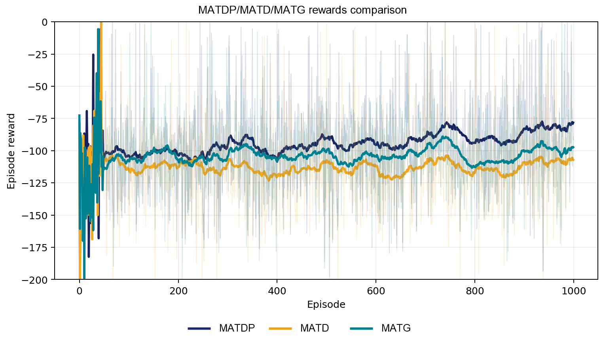
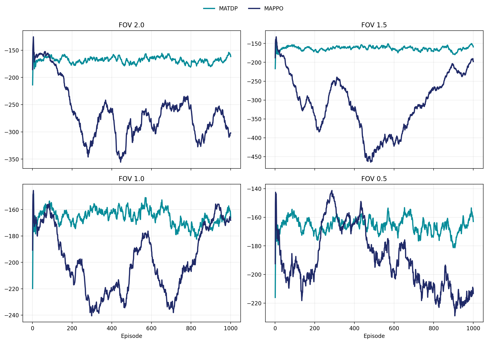

# MATDP: Multi-Agent Transformer–Diffusion–PPO for FOV-Limited Cooperative Control
> 📄 **Full thesis (PDF): [`DAIFEI_THESIS.pdf`](DAIFEI_THESIS.pdf)** — complete method, all
> experimental tables, and the failure analysis.
>
> **Implementation scope:** the released code is the core framework (FOV masking, dual Transformer,
> joint diffusion policy, PPO). The thesis' additional training-stabilization components —
> **Sinkhorn-based PBRS**, **Hungarian assignment auxiliary objective**, and **curriculum training** —
> were developed and run on a lab server whose access expired after graduation, so they are documented
> in the thesis but not included in this repository.

Reference implementation for the Master's thesis
**"A Study on Multi-Agent Reinforcement Learning using Transformer-Diffusion-PPO"**
(Korea National University of Transportation, 2026).

**TL;DR** — A CTDE framework for cooperative continuous control under **severe partial observability**:
each agent encodes a short history of **FOV-masked** local observations with a Transformer, a
**team-level Transformer** produces a cross-agent latent, and a **joint diffusion policy** generates
all agents' 15-D action vector at once; the policy is trained online with **PPO**. On the MPE
`simple_spread` benchmark (3 agents, 3 landmarks) across a **four-stage FOV schedule (2.0 → 1.5 → 1.0
→ 0.5)**, MATDP obtains the best final-100-episode success rate at **every** stage
(**0.190 / 0.170 / 0.150 / 0.150**) against two internal ablations (MATD, MATG) and an external
**MAPPO** baseline.



---

## 1. Method

The task is formulated as a **decentralized partially observable MDP**: each actor receives a short
history (**H = 10**) of local observations masked by a **field-of-view (FOV) radius**, while a
**centralized critic** uses unmasked observations during training (CTDE).

| # | Component | Role |
|---|---|---|
| ① | **Per-agent Transformer encoder** | Encodes each agent's FOV-masked observation history into a latent |
| ② | **Team-level Transformer** | Cross-agent attention → joint latent representing the team state |
| ③ | **Joint diffusion policy** | Denoising chain conditioned on the team latent; produces the **15-D joint action** (3 agents × 5 dims) in one shot |
| ④ | **PPO with diffusion log-probabilities** | Online updates using **step-average diffusion log-probabilities**, clipped objective, value clipping, target-KL early stop |

Training stabilizers: **potential-based reward shaping (PBRS)** with annealing, a **coverage bonus**,
and an **assignment auxiliary objective** used as pretraining.

## 2. Experimental protocol

| Item | Setting |
|---|---|
| Environment | MPE `simple_spread_v3` (PettingZoo / MPE2), continuous actions |
| Agents / landmarks | 3 / 3 |
| Observation | FOV-masked local observation history (H = 10) + visibility flags |
| FOV schedule | **Four-stage flow**: radius 2.0 → 1.5 → 1.0 → 0.5 (`--fov-radius`) |
| Episodes | 500–1000 per run, `max_cycles = 50` |
| Seeds | 3 seeds per configuration (`exp_seeds = [0, 1, 2]`) |
| Primary metric | **`success_last100`** — mean success rate over the final 100 episodes |
| Secondary metrics | `total_success`, `coverage_last100`, `maxdist_last100`, `reward_last100`, `det_eval_last` |

`success` requires **all landmarks to be covered simultaneously** by the agents within an episode —
a strict criterion under FOV-limited observations.

## 3. Results

### 3.1 Main flow comparison (`Table 4.3`)

| FOV radius | **MATDP** (Transformer + diffusion + PPO) | MATD (no online PPO update) | MATG (Gaussian actor instead of diffusion) |
|---|---|---|---|
| 2.0 | **0.190** | 0.060 | 0.070 |
| 1.5 | **0.170** | 0.060 | 0.080 |
| 1.0 | **0.150** | 0.050 | 0.100 |
| 0.5 | **0.150** | **0.010** | 0.110 |

MATDP has the highest success rate at **every** FOV stage.

### 3.2 Auxiliary metrics (`Table 4.4`, FOV = 2.0 / 1.5 / 1.0)

| FOV | Method | Total success | Coverage | MaxDist ↓ | Reward |
|---|---|---|---|---|---|
| 2.0 | MATDP | **101** | 0.290 | **0.368** | **−80.85** |
| 2.0 | MATD | 47 | 0.293 | 0.420 | −108.46 |
| 2.0 | MATG | 46 | 0.283 | 0.425 | −97.88 |
| 1.5 | MATDP | **139** | **0.300** | **0.358** | **−78.38** |
| 1.5 | MATD | 40 | 0.290 | 0.431 | −108.15 |
| 1.5 | MATG | 64 | 0.290 | 0.398 | −92.63 |
| 1.0 | MATDP | **143** | 0.293 | **0.430** | **−80.82** |
| 1.0 | MATD | 39 | 0.290 | 0.507 | −121.62 |

### 3.3 External baseline: MATDP vs MAPPO

MATDP stays stable (−150 to −170 episode reward) across all four FOV stages, while **MAPPO degrades
sharply** as the observation radius shrinks:



### 3.4 Findings

1. **Online PPO adaptation is necessary.** MATD (same Transformer + diffusion actor, but **no online
   policy updates**) collapses at FOV = 0.5: 0.010 vs MATDP's 0.150 (12 vs 81 successful episodes).
   Assignment pretraining alone does not adapt the policy to shrinking FOV.
2. **Joint diffusion action modeling helps the main metric.** MATDP beats the Gaussian-actor variant
   MATG at all four stages. *Honest caveat*: MATG is competitive on some auxiliary metrics
   (coverage, deterministic evaluation) — the claim is a **better success-rate profile**, not
   superiority on every metric.
3. **Advantage over a mature CTDE baseline.** Against MAPPO under an aligned fixed-FOV reward
   protocol, MATDP keeps its reward level while MAPPO's collapses in the harder stages.
4. **Documented limitation (`Table 4.6`, `Table 4.7`).** In the extreme **FOV = 0.5** condition MATDP
   still produces stochastic successes, but **deterministic evaluation remains 0.000**. Diagnostics
   over actor-side memory (structured memory, GRU-style memory vs. plain Transformer) and stronger
   exploration show only limited improvement, indicating that the bottleneck is **insufficient
   information flow under severe partial observability** rather than policy capacity.

## 4. Repository structure

```
paper/
├── main.py                  # training / evaluation entry point (argparse + train loop)
├── config.py                # all hyperparameters and experiment defaults
├── env/simple_env.py        # MPE simple_spread wrapper: FOV masking, visibility flags, PBRS, coverage bonus
├── models/
│   ├── encoder.py           # per-agent sequence encoders (MLP / Transformer)
│   ├── actor.py             # encoder → (team Transformer) → diffusion / Gaussian policy
│   ├── diffusion.py         # diffusion policy: joint (15-D) and per-agent variants
│   ├── gaussian.py          # Gaussian policy baseline (MATG)
│   └── critic.py            # centralized critic (CTDE)
├── utils/
│   ├── advantage.py         # GAE
│   ├── buffer.py            # rollout buffer
│   └── logger.py            # metrics logging + plotting
└── figures/                 # thesis result figures
    └── archive/             # early ablation plots (different protocol, see note below)
```

## 5. How to run

```bash
pip install -r requirements.txt

# Main method (MATDP): one FOV stage of the flow
python main.py --method full --seed 0 --episodes 1000 --fov-radius 2.0 --log-dir logs/fov2.0_seed0

# Repeat for the other three FOV stages to reproduce the full four-stage flow
python main.py --method full --seed 0 --episodes 1000 --fov-radius 1.5 --log-dir logs/fov1.5_seed0
python main.py --method full --seed 0 --episodes 1000 --fov-radius 1.0 --log-dir logs/fov1.0_seed0
python main.py --method full --seed 0 --episodes 1000 --fov-radius 0.5 --log-dir logs/fov0.5_seed0

# Ablations (same protocol)
python main.py --method no_diffusion   --fov-radius 0.5 ...   # Gaussian actor (MATG-style)
python main.py --method no_transformer --fov-radius 0.5 ...   # no Transformer encoder
```

Useful flags: `--n-agents`, `--history-len`, `--diffusion-steps`, `--pbrs/--pbrs-scale`,
`--coverage-bonus`, `--fov-mask/--fov-radius/--fov-visibility`, `--ppo-epochs`, `--resume`.

> **Note on the archive figures.** `figures/archive/` holds early ablation plots produced with an
> earlier protocol (single seed, fixed FOV, no staged flow); their success-rate panel is close to
> zero and is **not** comparable with the staged-flow results above. They are kept only as a record
> of the development process.

## 6. Limitations and future work

- **Deterministic coordination in extreme visibility conditions** remains unsolved (det. eval = 0.000
  at FOV = 0.5); the identified bottleneck is information flow, not policy capacity.
- No explicit **communication channel** between agents — a natural next step.
- Environment scope is limited to `simple_spread`; richer benchmarks (multi-agent MuJoCo,
  SMAC-style tasks) are needed to test generality.

## 7. Citation

```bibtex
@mastersthesis{dai2026matdp,
  title  = {A Study on Multi-Agent Reinforcement Learning using Transformer-Diffusion-PPO},
  author = {Dai, Fei},
  school = {Korea National University of Transportation},
  year   = {2026}
}
```
